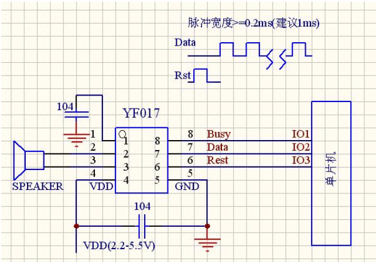
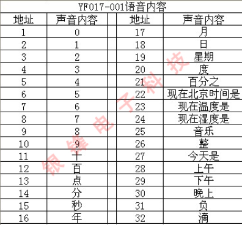

# 排队叫号系统设计

类似食堂取餐的模式。首先，学生排队，服务员使用键盘给顾客分配号码，按下确定键，数码管显示当前队列中的人数、刚刚进入队列的号码，并通过串口通信的方式将队列人数和当前分配的号码发送给从机，从机将数据显示在1602液晶屏上。另外，主机通过键盘按键选择取餐功能，按下出队键，叫到要取餐的号码，并通过语音播报取餐号码。

## 一、环境依赖

- windows10
- Keil uVision5
- stc-isp烧录
- Proteus 8 Professional

## 二、项目结构说明

1. src：主机和从机 C代码
   - server（主机代码）
     - main.c：主程序入口
     - FIFOQUEUE.h/FIFOQUEUE.c：FIFO循环队列实现
     - config.h：FIFO循环队列配置
     - server_uart.h/server_uart.c：双机串口通信服务端代码
   - client（从机代码）
     - main.c：主程序入口
     - lcd.h/lcd.c：1602A显示屏驱动程序
     - client_uart.h/client_uart.h：双机串口通信客户端代码
2. resources：芯片手册、电路图等
3. QueueSystem_proteus_simulation：proteus电路仿真

## 三、硬件清单

|         硬件         | 数量（个） |
| :------------------: | :--------: |
| STC89C52RC（DIP-40） |     2      |
|  11.0592MHZ无源晶振  |     2      |
|       74HC573        |     2      |
|    4位共阴数码管     |     2      |
|   1602A液晶显示屏    |     1      |
|     4x3薄膜键盘      |     1      |
|      1k 9针排阻      |     2      |
|    YF017语音芯片     |     1      |
|        扬声器        |     1      |
|      10k变阻器       |     1      |
|     30pf陶瓷电容     |     4      |
|     104陶瓷电容      |     2      |

## 四、最佳实践

在`src`目录下提供了主机和从机的源代码，您可以先新建两个keil项目（51单片机），然后分别将这两部分代码添加到你新建的keil工程下面，编译并生成hex文件。

**仿真：**然后使用Proteus打开`QueueSystem_proteus_simulation`目录下的Proteus仿真电路，并将上一步生成的两个hex文件分别添加到两块8051单片机中，进行仿真。

**面包板连接注意事项：**

- 不推荐使用面包板专供电源，电压可能达不到5V，导致单片机P口输出高低电平有问题，而且如果使用面包板专用电源的GND，那么串口通信是无法实现的（可能是面包板电源的GND电压也有问题）。在我调试硬件的过程中，有超过一半的问题都是电源问题引起的，所以我建议如果你有51核心板，可以使用杜邦线将该板子的VCC和GND接到你的面包板电路中，而不是使用面包板专用电源。
- 我是用的是102孔面包板，这种面包板左右两侧和上下两侧的电源不是连通的，需要你自己用跳线连接。
- 尽量使用跳线进行连接，最终的电路美观而且运行稳定。（不建议大范围使用杜邦线）
- 对于51单片机来说，要进行双机串口通信，两个单片机的晶振应当相同，我建议使用`11.0592MHZ`的无源晶振，再加两个30pf的陶瓷电容连城晶振电路。（11.0592MHZ计算的波特率无误差）
- 数码管应注意是共阴还是共阳。
- 51单片机P0口要接1k的上拉电阻（使用9针排阻）。

**项目运行逻辑：**先通过4x3薄膜键盘输入两位数字，然后按下`#`按键（即确定键），即可将该号码添加到队列中，并且在左面第一个4位数码管的前两位显示刚叫到的号码，第4位显示队列中的人数。同时观察到从机连接的1602显示屏上显示的`queue_sum:`和`number:`字段也同步显示了队列中的总人数和刚入队的号码。按下`*`键，表示叫号取餐，右侧数码管显示需要取餐的号码（队列中第一个），同时队列中第一个人出队列，队列中总人数减一。


## 五、设计思路

分几大功能模块进行说明：主机（4x3薄膜键盘驱动、数码管动态显示、YF017语音芯片驱动、串口通信发送端），从机（1602A驱动、串口通信接收端）

### 5.1 4x3薄膜键盘驱动

从Proteus仿真电路中可以看到，薄膜键盘4行A、B、C、D分别接在P2.0、P2.1、P2.2、P2.3口，3列1、2、3分别接在P2.4、P2.5、P2.6口。一开始我本打算用驱动矩阵键盘的类似代码来写薄膜键盘的驱动程序，但是在测试过程种却不尽人意，同样的代码并没有像矩阵键盘一样获取按键事件。因此用了笨办法，每一行每一列都分开检测，并且取消了按键消抖延时。

```c
sbit R1 = P2^0;
sbit R2 = P2^1;
sbit R3 = P2^2;
sbit R4 = P2^3;

sbit C1 = P2^4;
sbit C2 = P2^5;
sbit C3 = P2^6;

int scanKey(){
    // return: -1代表*，10代表#，其余0-9分别对应数字0-9
	R1=0,R2=1,R3=1,R4=1;
	if(C1==0)
		return 1;
	if(C2==0)
		return 2;
	if(C3==0)
		return 3;
	
	R1=1,R2=0,R3=1,R4=1;
	if(C1==0)
		return 4;
	if(C2==0)
		return 5;
	if(C3==0)
		return 6;
	
	R1=1,R2=1,R3=0,R4=1;
	if(C1==0)
		return 7;
	if(C2==0)
		return 8;
	if(C3==0)
		return 9;
	
	R1=1,R2=1,R3=1,R4=0;
	if(C1==0)
		return -1;
	if(C2==0)
		return 0;
	if(C3==0)
		return 10;
	
	return -2;
}
```

### 5.2 数码管动态显示

使用两块74HC573寄存器芯片第一块芯片控制数码管位选，第二块芯片控制数码管段选。P1.6和P1.7口分别定义为`DULA`和`WELA`变量来控制位选和段选。单片机P0口接到74HC573的D0-D7口。第一块的Q0-Q7口分别接到两个4位共阴数码管的A-G、DP管脚，第二块的Q0-Q7口接到两个4位共阴数码管的1-4段选管脚。这块的代码简单而且网上例子很多，就不再此粘贴多余代码了，只需注意共阴和共阳数码管的编码是不同的。硬件连接的时候注意74HC573和数码管的引脚需对应即可（在`resources`目录下有4位数码管和74HC573的管脚图）

### 5.3 YF017语音芯片驱动

[YF017淘宝链接](https://item.taobao.com/item.htm?spm=a1z09.2.0.0.67002e8dR2AG1O&id=595340782904&_u=f3ohdi11ede7)

YF017系列语音芯片是针对市场推出的一款具有PWM输出的OTP语音标准芯片。共有3个IO口，外围最低仅需要一个104电容就可以稳定的工作。YF017系列语音芯片内置电阻，没有外围元件，外围电路只需要一个104电容。

如下图所示为YF017语音芯片的基本应用电路，从原理图种我们可以看出，只需要单片机只需要3个I/O口就可以驱动该芯片。此芯片控制方式是采用了模拟串行的控制方式。如需要播放第几个地址的内容就发送几个脉冲（大于0.2ms即可，建议采用1ms左右）的原理，可以快速的控制32段地址的任意组合。



下图所示是YF017内部地址储存的32段语音，对于本项目我们只用到地址1-11的内容。



 有关此芯片的更多内容可以查看`resources`目录下`YF017.pdf`。也可访问该芯片的[淘宝链接](https://item.taobao.com/item.htm?spm=a1z09.2.0.0.67002e8dR2AG1O&id=595340782904&_u=f3ohdi11ede7)。

YF017的驱动程序（根据之前提到的YF017脉冲控制原理，得到如下代码）：

```c
void music(int z){
	rest = 1;
	delay_ms(2);
	rest = 0;	
	delay_ms(2);
    //z个脉冲，得到第z段地址
	while(z > 0){
		dat = 1;
		delay_ms(1);
		dat = 0;
		delay_ms(1);
		z--;
	}
}
```

> 注意：每段语音的播放都需要时间（1秒左右）。因此，在使用YF017的过程中，你的代码中不能写`music(2); music(3); music(4);`类似这样的代码，这样只有music(2)可以播放，其他两段还没播放就运行到下一段代码了，所以每一次music()之后都要延时1s左右。
>
> 但是，我们的代码是顺序执行的，所有程序都在一个while循环中，而且数码管的动态显示需要的延时必须在10ms以内，之后要讲到的串口通信也要保证间隔时间不长地发送数据，防止接收端阻塞。而每次语音的正常播放就要1s左右的延时，所以只写顺序执行的代码明显是不符合要求的。此时就要求我们的代码具有一定的并行执行能力，对目前我们遇到的问题来说就是延时不能影响主循环的正常运行。
>
> 要在单片机实现程序并行执行无非两种方法：硬件（定时器）或软件编程控制。在本项目中，我使用定时器来实现这种“一定程度的程度并行”。通过定时器计时得到1s（局部变量累加）的时长。然后定义一个局部变量sound_times，当计时到1s时，局部变量+1，根据这个局部变量的值再加一个if条件判断即可实现music()的1s延时。具体实现可以参考`src/server/main.c`中的代码。

### 5.4 串口通信发送端

通过设置串行控制寄存器SCON，TMOD、THX、TLX设置波特率。串口通信原理在这里不再详述。只是在具体地使用send()函数和receive()进行发送时需要注意，我们发送两个数据：队列人数和当前通过按键获取的号码，因此需要使用两个变量作为flag标志，发送数据前先发送该数据的flag，接收数据时先对该flag进行判断然后再接收数据并赋值。

硬件连接：将两个单片机的RXD和RXD交叉连接，这样就可以构成一个简单的双机通信链路。晶振推荐使用11.0592MHZ，波特率设置无误差。

### 5.5 1602A驱动


### 5.6 串口通信接收端

见**5.4串口通信发送端**。


