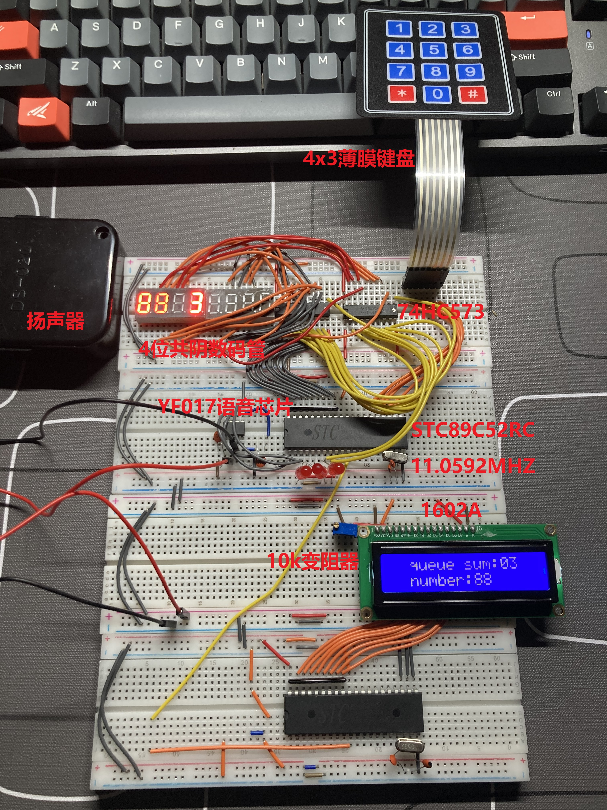

# 排队叫号系统设计

类似食堂取餐的模式。首先，学生排队，服务员使用键盘给顾客分配号码，按下确定键，数码管显示当前队列中的人数、刚刚进入队列的号码，并通过串口通信的方式将队列人数和当前分配的号码发送给从机，从机将数据显示在1602液晶屏上。另外，主机通过键盘按键选择取餐功能，按下出队键，叫到要取餐的号码，并通过语音播报取餐号码。

## 一、环境依赖

- windows10
- Keil uVision5
- stc-isp烧录
- Proteus 8 Professional

### 二、项目结构说明

1. src：主机和从机 C代码
   - server（主机代码）
     - main.c：主程序入口
     - FIFOQUEUE.h/FIFOQUEUE.c：FIFO循环队列实现
     - config.h：FIFO循环队列配置
     - server_uart.h/server_uart.c：双机串口通信服务端代码
   - client（从机代码）
     - main.c：主程序入口
     - lcd.h/lcd.c：1602A显示屏驱动程序
     - client_uart.h/client_uart.h：双击串口通信客户端代码
2. resources：芯片手册、电路图等
3. QueueSystem_proteus_simulation：proteus电路仿真

### 三、硬件清单

|         硬件         | 数量（个） |
| :------------------: | :--------: |
| STC89C52RC（DIP-40） |     2      |
|  11.0592MHZ无源晶振  |     2      |
|       74HC573        |     2      |
|    4位共阴数码管     |     2      |
|   1602A液晶显示屏    |     1      |
|     4x3薄膜键盘      |     1      |
|      1k 9针排阻      |     2      |
|    YF017语音芯片     |     1      |
|        扬声器        |     1      |
|      10k变阻器       |     1      |
|     30pf陶瓷电容     |     4      |
|     104陶瓷电容      |     2      |

### 四、最佳实践

在`src`目录下提供了主机和从机的源代码，您可以先新建两个keil项目（51单片机），然后分别将这两部分代码添加到你新建的keil工程下面，编译并生成hex文件。

然后使用Proteus打开`QueueSystem_proteus_simulation`目录下的Proteus仿真电路，并将上一步生成的两个hex文件分别添加到两块8051单片机中，进行仿真。

项目运行逻辑：先通过4x3薄膜键盘输入两位数字，然后按下`#`按键（即确定键），即可将该号码添加到队列中，并且在左面第一个4位数码管的前两位显示刚叫到的号码，第4位显示队列中的人数。同时观察到从机连接的1602显示屏上现实的`queue_sum:`和`number:`字段也同步显示了队列中的总人数和刚入队的号码。按下`*`键，表示叫号取餐，队列中第一个人出队列，队列中总人数减一。

 

