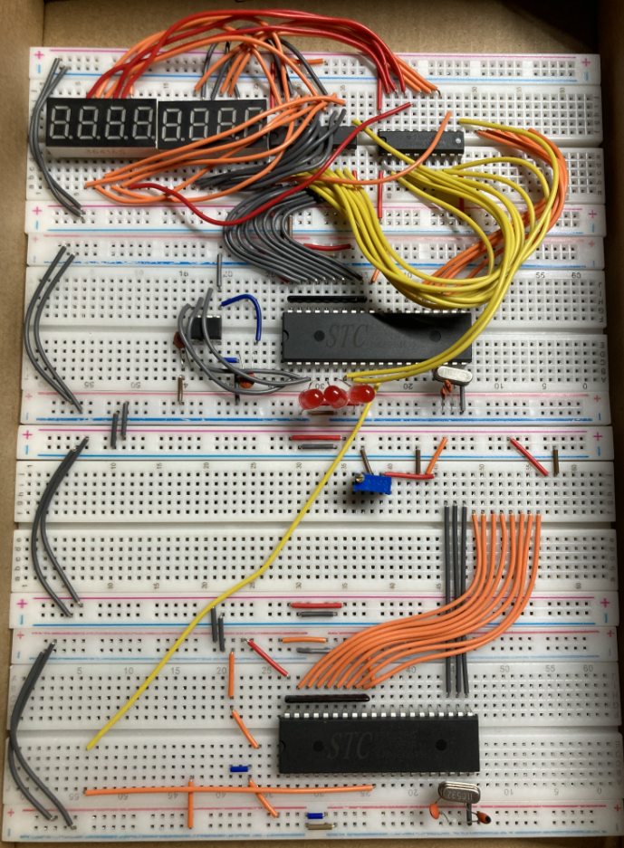

# 单片机项目合集

## 1、排队叫号系统设计

改为类似食堂取餐的模式。学生先排队，通过薄膜键盘叫号，按下确定键，数码管显示当前队列中的人数、刚刚进入队列的号码。主机通过薄膜键盘取餐，按下出队键，被叫到要取餐的号码，并通过语音播报取餐号码。 主机通过串口将刚刚进入队列的号码以及队列的人数发送给从机，并且显示在1602液晶屏上。（从机还可以显示以下当前队列中的号码）

 

RPC failed!